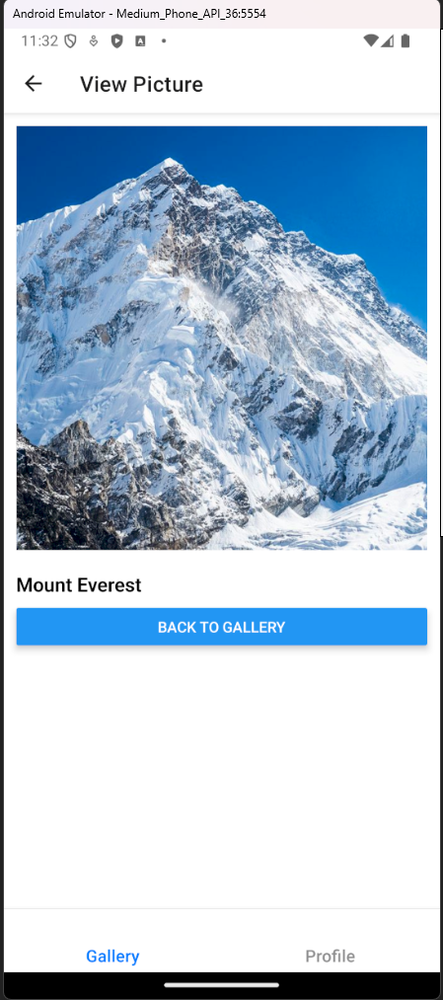
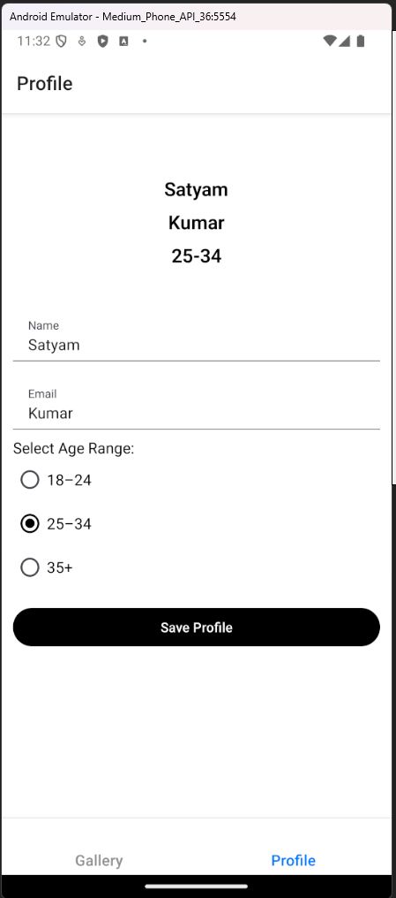
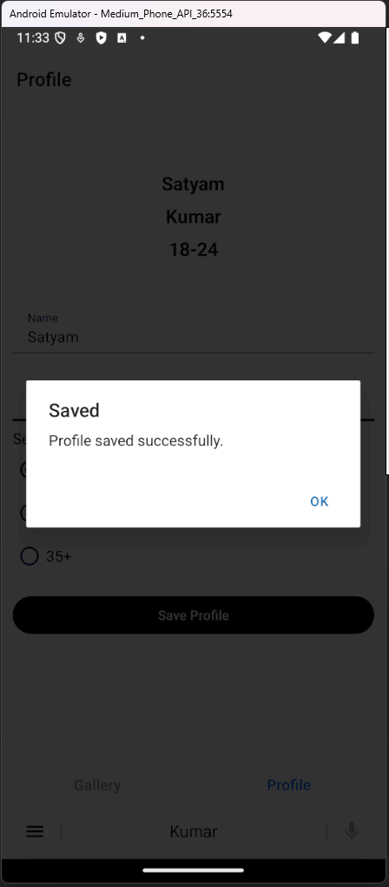
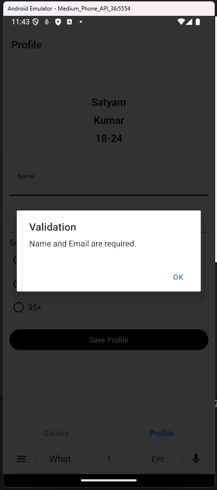

# React Native Gallery App

This mobile app was built as part of a React Native assignment focused on advanced UI and functionality. It allows users to:

- Browse a gallery of images
- View images in full-screen mode
- Edit and save their profile

## Screenshots

### 1. Gallery Screen

### 2. Picture Viewing Screen

### 3. Profile Screen

### 3. Saved profile

### 3. Validation

---

## Libraries Used

- React Native
- React Navigation (Stack + Bottom Tabs)
- React Native Paper (for UI components)
- AsyncStorage (local persistent storage)