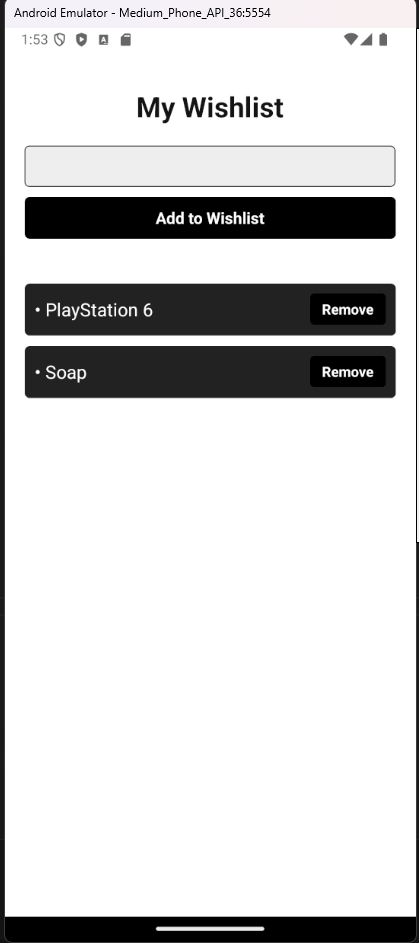

# Wishlist App

A simple, stylish React Native app that allows users to maintain a **wishlist**.

---

## Design and Purpose

This app helps users keep track of their wishlist in a quick, minimalistic format. 

**Target audience**: Mobile users who want a simple and clean wishlist app without extra clutter.

---

## Basic Use

1. Open the app.
2. Type your item into the input field.
3. Tap **"Add to Wishlist"** to save it.
4. View your wishlist below.
5. Tap **"Remove"** to delete an item from your list.

---

## Features

- Add items to wishlist
- Remove items with a button
- Input validation to prevent blank entries
- Stylish black & white themed UI

---

## Components Used

- `View`
- `Text`
- `TextInput`
- `TouchableOpacity`
- `FlatList`
- `Alert`
- `StatusBar`

---

**Figure 1**: Empty List.

**Figure 2**: Error message when the input field is empty, and you click add to wishlist.

**Figure 3**: Full list with several items and remove buttons.

**Figure 3**: Full list after deleting a item.

---
